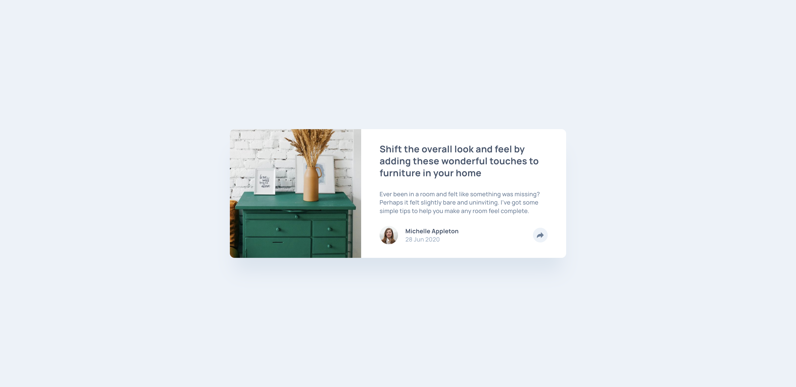

# article-preview-component

fe-mentor article-preview-component website challenge submission

## Tools

- HTML
- CSS
- JavaScript
- Figma

## Process / Methodology

- Semantic HTML5 markup
- CSS custom properties
- Flexbox
- CSS Grid
- Mobile-first workflow
- JavaScript interactivity

## What I learned

## View live site here 
https://09-article-preview-component.netlify.app/

##### Final Screenshot

