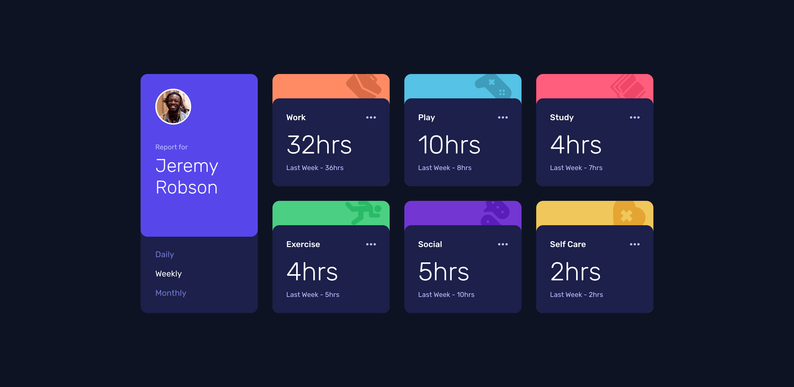

# time-tracking-dashboard

fe-mentor time-tracking-dashboard website challenge submission

## Tools

- HTML
- CSS
- JavaScript
- Figma

## Process / Methodology

- Semantic HTML5 markup
- CSS variables
- Flexbox
- CSS Grid
- Mobile-first workflow
- JavaScript interactivity
- JSON data handling

## What I learned
- JSON fetching
- JSON parsing

## View live site here 
https://11-time-tracking-dashboard.netlify.app/

##### Final Screenshot

