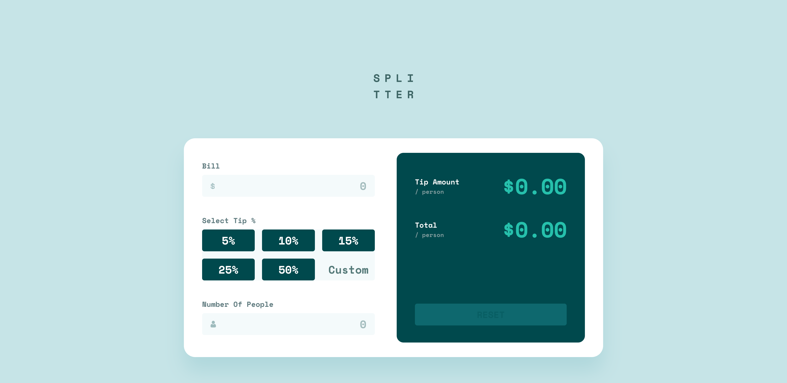

# tip-calculator-app

fe-mentor tip-calculator-app challenge submission

## Tools
HTML
CSS / SASS
JAVASCRIPT
FIGMA (Design)

## Process / Methodology
MVC architecture
Mobile first implementation
Media Queries

## What I learned
- Separation of concerns
- Validating data values and types
- Handling state changes

## View live site here 
https://12-tip-calculator-app.netlify.app/

##### Final Screenshot

