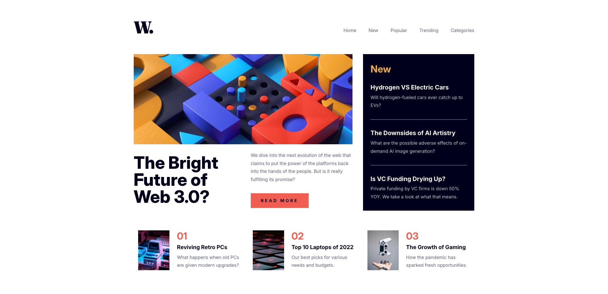

# News Homepage
fe-mentor news-homepage challenge submission

## Tools
* HTML
* CSS
* JAVASCRIPT
* FIGMA

## Process / Methodology
- Mobile first 
- Responsive
- Media Queries
- CSS Tokens
- Semantic HTML
- Accessibility
- W3C
- WCAG
- WHATWG (Web Hypertext Application Technology Working Group)

## What I learned
- Responsive menu system

## View live site here 
https://18-news-homepage.netlify.app/

##### Final Screenshot
