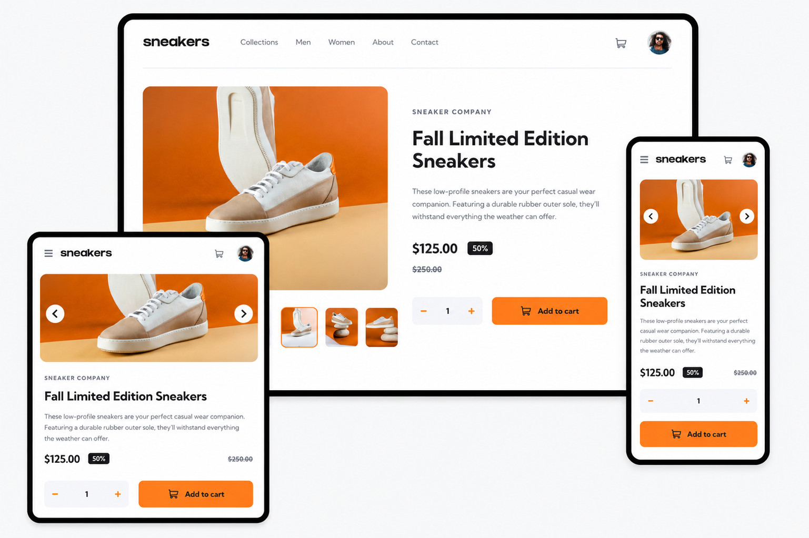

# E-Commerce Product Page
fe-mentor e-commerce product page challenge submission

## Tools
- HTML
- CSS
- JS

## Process / Methodology
- Mobile first
- Responsive / Fluid layout
- Keyboard accessibility

## What I learned
- A11y: native html states, aria-expanded, aria-controls, aria-describedby, aria-live, visually hidden content, skip links, focus rules, keyboard escape behavior, focus order, accessible descriptions, tabindex, focus traps, roving indexes

## View live site here 
https://19-e-commerce-product-page.netlify.app/
    
##### Final Screenshot
